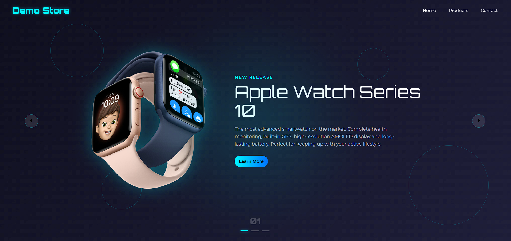

# 🛍️ Demo Store (Full Stack)

Welcome to **Demo Store**, now a **full stack e-commerce** project! This version uses modern technologies for both frontend and backend, including authentication and PostgreSQL database integration.

👉 [Check out the live demo here!](https://demostore-rho.vercel.app/)

---

## ✨ Features

✅ Responsive and modern layout
✅ Product listing from database
✅ Add products to cart
✅ Automatic total price calculation
✅ User authentication (JWT)
✅ Order management
✅ PostgreSQL integration
✅ TypeScript everywhere
✅ User-friendly interface

---

## 🧰 Technologies Used

  
  
  
  
  
  
  


---

## 📸 Screenshots

> 

---

## 🚀 How to Use

1. Clone this repository:

   ```bash
   git clone https://github.com/your-username/demo-store.git

   ```

2. Install dependencies:
   ```bash
   cd backend
   npm install
   cd ../frontend
   npm install

   ```
3. Configure PostgreSQL and Prisma:

   - Set up your PostgreSQL database
   - Update `backend/.env` with your database URL
   - Run Prisma migrations:

   ```bash
   cd backend
   npx prisma migrate dev
   ```

4. Start the backend server:

   ```bash
   npm run dev
   ```

5. Start the frontend:
   ```bash
   cd ../frontend
   npm run dev
   ```

6. Open the app in your browser:
Frontend: http://localhost:5173
Backend API: http://localhost:3000

---

## 🗂️ Project Structure
```
backend/
   src/
   package.json
   tsconfig.json
   ...
frontend/
   src/
   package.json
   tsconfig.json
   ...
```

---